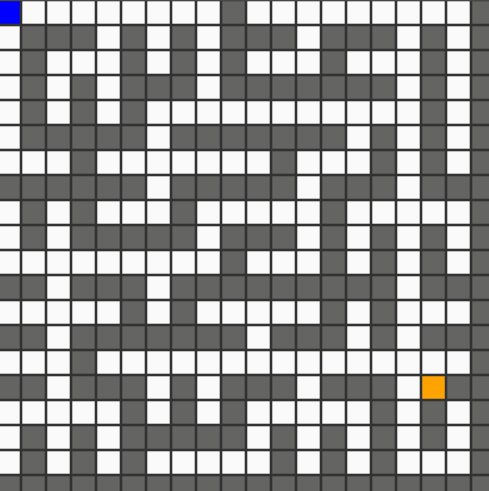

# Planning-Algorithm-Visualization

A repo for visualizing common planning algorithm.
 
## Installation
Use pip to install pygame.
```bash
pip3 install pygame
```

## Usage
```bash
python3 main.py (algorithm name)
```

## Examples
 
 
### A* Path Planning

