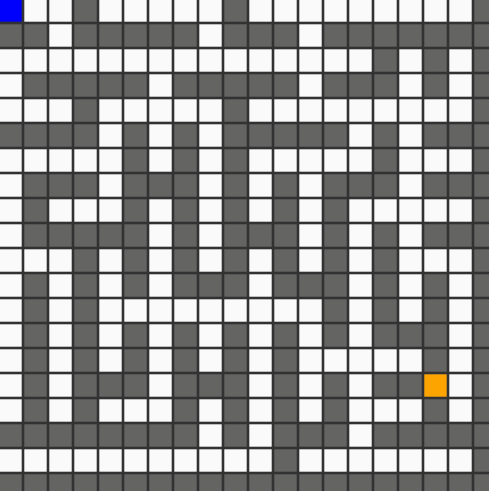

# Planning-Algorithm-Visualization

A repo for visualizing popular planning algorithm.
 
## Installation
Use pip to install pygame.
```bash
pip3 install pygame
```

## Usage
```bash
python3 (algorithm name)_main.py
```

## Examples
 
 
### A* Path Planning
  
  
### RRT Path Planning
